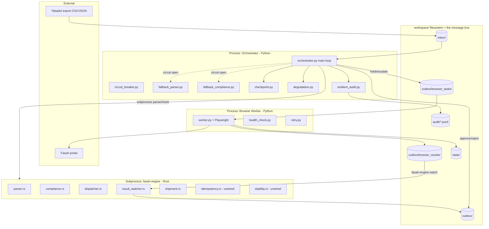
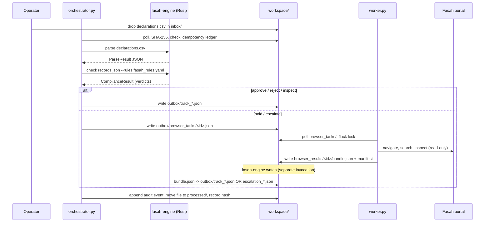
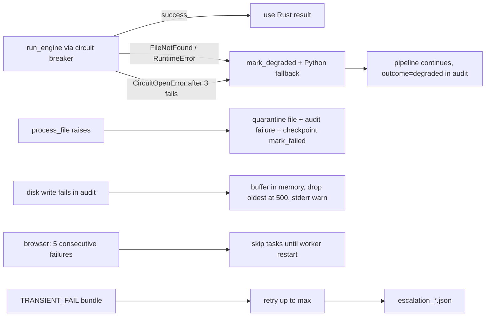

# 03 — Current Architecture (As-Built) / المعمارية الفعلية

> This documents the architecture **that exists**, including its warts — not an idealized target. Target-state lives in `specs/project-evolution/plan.md`.

## Component map / خريطة المكونات

## Data flow — happy path / تدفق البيانات (مسار النجاح)

## Failure / degradation paths / مسارات الفشل والتدهور

## Module boundaries / حدود الوحدات

| Boundary | Contract | Coupling |
|----------|----------|----------|
| Orchestrator ↔ engine | CLI argv + JSON on stdout | Loose (subprocess); versioned only by argv shape |
| Orchestrator ↔ worker | `browser_tasks/*.json` (`fasah_task.schema.json`) | Loose (file drop); **schema not enforced** |
| Worker ↔ result watcher | `browser_results/*/bundle.json` (`fasah_bundle.schema.json`) | Loose (file drop); **impl violates schema — GAP-CONTRACT-001** |
| Engine ↔ engine (dispatch/watch) | `.pending_tasks.json` ledger | Shared file; **bypassed by Python dispatcher — GAP-ARCH-001** |

## Entry points / نقاط الدخول
`fasah-engine {parse,check,watch}` (`main.rs`); `orchestrator.py`; `worker.py`; `python -m src.utils.health`.

## External connections / الاتصالات الخارجية
Only the browser worker reaches the network (Fasah portal via Chromium). Everything else is local filesystem + subprocess. No inbound network listeners.

## Trust model / نموذج الثقة
- **Implicit trust of the inbox**: anything readable in `inbox/` is processed; no authentication of the file's origin, no signature, no size cap.
- **Portal trust** via persisted session cookies; the worker fails closed to `AUTH_FAIL` rather than attempting credential entry.
- **Prod hardening** only on the browser worker (gates 10/11); the orchestrator has no equivalent prod gate.
- Trust boundary between processes is the filesystem — whoever can write `workspace/` can inject tasks/commands.

## Where state lives / أماكن تخزين الحالة
Filesystem only: idempotency ledger, checkpoint JSON, outbox commands, audit JSONL, browser session `state.json`, task locks. In-memory only: circuit-breaker state, degradation registry, browser health counters (lost on restart).

## Lifecycle of the primary entity (a declaration) / دورة حياة الكيان
`received → parsed → checked → {approved | approved_with_conditions | held | rejected} → (held ⇄ checked) → released` (`shipment.rs`). **Note:** transitions are *defined and tested* but **not enforced at runtime** because the live orchestrator writes statuses directly (GAP-ARCH-003).

## Critical dependencies / الاعتماديات الحرجة
- Rust toolchain to build `fasah-engine` (fallbacks mitigate runtime absence, not build).
- Playwright + Chromium for any portal interaction (no fallback — if absent, hold/escalate items simply never get portal status).
- Filesystem durability + a stable single writer per directory.

## Bottlenecks / نقاط الاختناق
- Orchestrator processes **one file at a time**, sleeping between polls — throughput-bound by poll interval and browser latency.
- Browser worker is serial per task with multi-second Angular settle waits (`worker.py:445-446`).
- No parallelism/queue; scaling is "run more workers" but there is no work-partitioning to make that safe.

## Stable vs volatile components / المكونات المستقرة مقابل المتغيرة
| Stable (change rarely, well-tested) | Volatile (expected to change / fragile) |
|---|---|
| `parser.rs`, `compliance.rs`, `shipment.rs`, verdict taxonomy | `worker.py` portal selectors/routes (external UI drift) |
| Circuit breaker, checkpoint, degradation | `fasah_rules.yaml` (regulatory changes — by design) |
| File contracts (schemas) | Dual dispatcher / fallback drift (needs consolidation) |

## Architectural smells (as-built) / روائح معمارية
1. **Dual implementation drift** — parse/compliance/dispatch exist twice (Rust + Python) with confirmed divergences.
2. **Unwired modules** — `idempotency.rs`, `stability.rs`, `shipment.rs` transition-enforcement, and the JSON schemas are present but not on the live path.
3. **Contract not enforced** — schemas are documentation, not validation; one is already violated.
4. **Observability blind spots** — in-memory-only health/degradation across process boundaries; health CLI has a false-negative bug.
